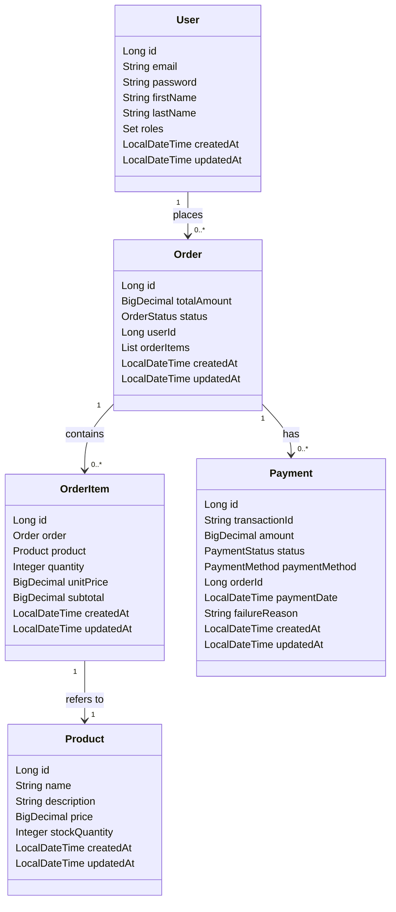

# Ecommerce Spring REST API

This document provides an overview of the REST API services available in the E-commerce application. The API is designed to handle various operations related to orders, authentication, payments, and products.

## API Services

### OrderService
- **Description**: Manages operations related to customer orders.
- **Endpoints**:
  - `GET /orders`: Retrieve all orders.
  - `GET /orders/{id}`: Fetch a specific order by its ID.
  - `POST /orders`: Create a new order.
  - `PUT /orders/{id}/status`: Update the status of an existing order.

### AuthService
- **Description**: Handles user authentication and registration processes.
- **Endpoints**:
  - `POST /auth/register`: Register a new user.
  - `POST /auth/login`: Authenticate a user and generate a JWT token.

### PaymentService
- **Description**: Manages payment processing and related operations.
- **Endpoints**:
  - `POST /payments`: Process a payment.
  - `GET /payments/{transactionId}`: Retrieve payment details by transaction ID.
  - `POST /payments/{transactionId}/refund`: Process a refund for a payment.

### ProductService
- **Description**: Manages operations related to products.
- **Endpoints**:
  - `GET /products`: Retrieve all products.
  - `GET /products/{id}`: Fetch a specific product by its ID.
  - `POST /products`: Create a new product.
  - `PUT /products/{id}`: Update an existing product.
  - `DELETE /products/{id}`: Delete a product by its ID.

## Controllers

### OrderController
- **Description**: Handles HTTP requests for order-related operations.
- **Endpoints**:
  - `GET /api/orders`: Retrieve all orders.
  - `GET /api/orders/{id}`: Fetch a specific order by its ID.
  - `POST /api/orders`: Create a new order.
  - `PUT /api/orders/{id}/status`: Update the status of an existing order.

### AuthController
- **Description**: Manages HTTP requests for user authentication and registration.
- **Endpoints**:
  - `POST /api/auth/register`: Register a new user.
  - `POST /api/auth/login`: Authenticate a user and generate a JWT token.

### PaymentController
- **Description**: Handles HTTP requests for payment processing.
- **Endpoints**:
  - `POST /api/payments`: Process a payment.
  - `GET /api/payments/{transactionId}`: Retrieve payment details by transaction ID.
  - `POST /api/payments/{transactionId}/refund`: Process a refund for a payment.

### ProductController
- **Description**: Manages HTTP requests for product-related operations.
- **Endpoints**:
  - `GET /api/products`: Retrieve all products.
  - `GET /api/products/{id}`: Fetch a specific product by its ID.
  - `POST /api/products`: Create a new product.
  - `PUT /api/products/{id}`: Update an existing product.
  - `DELETE /api/products/{id}`: Delete a product by its ID.

## HealthCheckContoller
- **Description**: Provides a simple health check endpoint to verify the application's status.
- **Endpoints**: `GET /health` 


## Models

### User

- **Package**: `com.example.ecommerce.models`
- **Table Name**: `users`
- **Description**: Represents a user in the e-commerce system.

| Field     | Type     | Description                          | Constraints          |
|-----------|----------|--------------------------------------|----------------------|
| email     | String   | Email address of the user            | Unique, Non-nullable |
| password  | String   | Password for user authentication     | Non-nullable         |
| firstName | String   | First name of the user               | Non-nullable         |
| lastName  | String   | Last name of the user                | Non-nullable         |
| roles     | Set<String> | Roles assigned to the user        | Fetched eagerly      |

#### Lifecycle Callbacks:
- `@PrePersist`: Initializes `createdAt` and `updatedAt` timestamps before the entity is persisted.

### Order

- **Package**: `com.example.ecommerce.models`
- **Table Name**: `orders`
- **Description**: Represents an order placed by a user.

| Field       | Type          | Description                  | Constraints          |
|-------------|---------------|------------------------------|----------------------|
| totalAmount | BigDecimal    | Total amount of the order    | Non-nullable         |
| status      | OrderStatus   | Status of the order          | Enum, Non-nullable   |
| userId      | Long          | ID of the user who placed the order |                  |
| orderItems  | List<OrderItem> | Items included in the order |                      |

#### Lifecycle Callbacks:
- `@PrePersist`: Initializes `createdAt`, `updatedAt`, and sets default `status` to `PENDING`.
- `@PreUpdate`: Updates the `updatedAt` timestamp.

### OrderItem

- **Package**: `com.example.ecommerce.models`
- **Table Name**: `order_items`
- **Description**: Represents an item in an order.

| Field     | Type       | Description                  | Constraints          |
|-----------|------------|------------------------------|----------------------|
| order     | Order      | The order to which this item belongs | Non-nullable         |
| product   | Product    | The product being ordered    | Non-nullable         |
| quantity  | Integer    | Quantity of the product ordered | Non-nullable         |
| unitPrice | BigDecimal | Price per unit of the product | Non-nullable         |
| subtotal  | BigDecimal | Calculated as `unitPrice * quantity` | Non-nullable         |

#### Lifecycle Callbacks:
- `@PrePersist`: Calculates `subtotal` and initializes timestamps.
- `@PreUpdate`: Recalculates `subtotal` and updates the `updatedAt` timestamp.

### Product

- **Package**: `com.example.ecommerce.models`
- **Table Name**: `products`
- **Description**: Represents a product available for purchase.

| Field          | Type       | Description                  | Constraints          |
|----------------|------------|------------------------------|----------------------|
| name           | String     | Name of the product          | Non-nullable         |
| description    | String     | Description of the product   | Up to 1000 characters|
| price          | BigDecimal | Price of the product         | Non-nullable         |
| stockQuantity  | Integer    | Quantity of the product in stock | Non-nullable         |

#### Lifecycle Callbacks:
- `@PrePersist`: Initializes `createdAt` and `updatedAt` timestamps.
- `@PreUpdate`: Updates the `updatedAt` timestamp.

## LLD Class Diagrams



## Monorepo Structure

The repository is now organized as a monorepo with the following modules:

- **api-gateway**: Handles routing and load balancing for the application using Spring Cloud Gateway.
- **auth-service**: Manages user authentication and registration processes.
- **order-service**: Manages operations related to customer orders.
- **payment-service**: Manages payment processing and related operations.
- **product-service**: Manages operations related to products.
- **common**: Contains shared models, enums, and configuration files used across all services.

## Building and Running the Monorepo

To build and run the monorepo, follow these steps:

1. Clone the repository:
   ```bash
   git clone https://github.com/nayanraj210401/ecommerce-rest-api.git
   cd ecommerce-rest-api
   ```

2. Build the project using Maven:
   ```bash
   ./mvnw clean install
   ```

3. Start the discovery service:
   ```bash
   cd discovery-service
   ./mvnw spring-boot:run
   ```

4. Start the API gateway:
   ```bash
   cd ../api-gateway
   ./mvnw spring-boot:run
   ```

5. Start the individual services (auth-service, order-service, payment-service, product-service) in separate terminal windows:
   ```bash
   cd ../auth-service
   ./mvnw spring-boot:run

   cd ../order-service
   ./mvnw spring-boot:run

   cd ../payment-service
   ./mvnw spring-boot:run

   cd ../product-service
   ./mvnw spring-boot:run
   ```

6. The application should now be running with the API gateway handling routing and load balancing for the individual services.

## Health Check Endpoints

Each module includes a health check endpoint to verify the application's status. The health check endpoints are as follows:

- **AuthService**: `GET /auth/health`
- **OrderService**: `GET /orders/health`
- **PaymentService**: `GET /payments/health`
- **ProductService**: `GET /products/health`

These endpoints can be used to monitor the health of each service and ensure they are running correctly.
