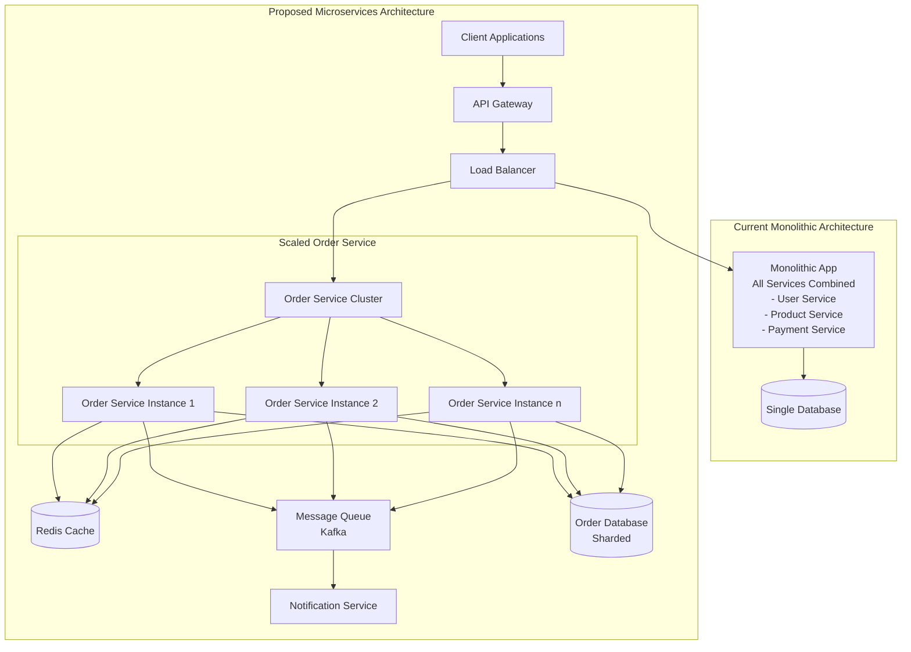
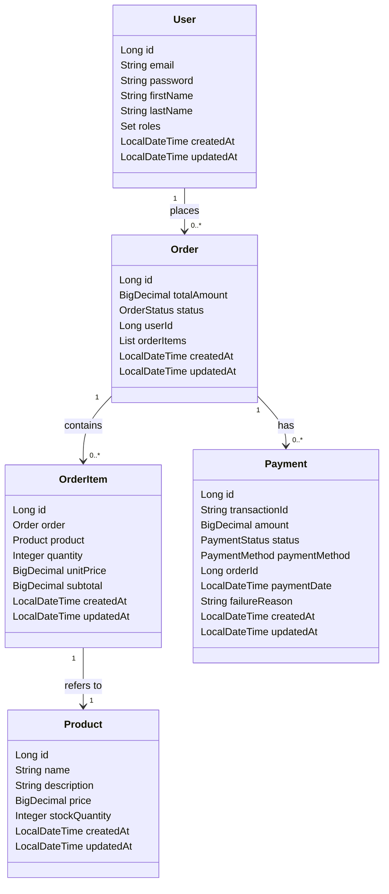

# E-commerce Microservices Project

This project is a microservices-based e-commerce application. It consists of several services, each responsible for a specific domain of the application. The services communicate with each other using REST APIs and are registered with a discovery service.

## Services

- **API Gateway**: Handles routing of requests to the appropriate microservices.
- **Common Libraries**: Contains shared code and utilities used by other services.
- **Discovery Service**: Manages service registration and discovery.
- **Order Service**: Manages order-related operations.
- **E-commerce Service**: Manages product, user, and payment-related operations.

## Instructions to Start the Project

1. **Clone the repository**:
   ```sh
   git clone https://github.com/nayanraj210401/ecommerce-rest-api.git
   cd ecommerce-rest-api
   ```

2. **Start the Discovery Service**:
   ```sh
   cd discovery-service
   ./mvnw spring-boot:run
   ```

3. **Start the API Gateway**:
   ```sh
   cd ../api-gateway
   ./mvnw spring-boot:run
   ```

4. **Start the Common Libraries**:
   ```sh
   cd ../common-libs
   ./mvnw clean install
   ```

5. **Start the Order Service**:
   ```sh
   cd ../order-service
   ./mvnw spring-boot:run
   ```

6. **Start the E-commerce Service**:
   ```sh
   cd ../ecommerce-service
   ./mvnw spring-boot:run
   ```

## High-Level Design (HLD)




## Low-Level Design (LLD)


